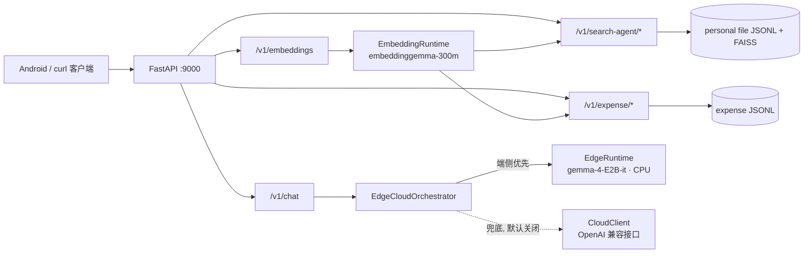

# 端上文件助手 · 端云结合 Agent

**端侧优先、云端可选**的轻量 Agent：端侧用 `google/gemma-4-E2B-it`（生成）+
`google/embeddinggemma-300m`（向量）在本机推理，云端为可选兜底（OpenAI 兼容接口，
选型未定，默认关闭）。数据全部本地存储（JSONL + FAISS），无外部数据库。

在此之上目前打通两个端侧场景：

| 场景 | 闭环 | 状态 |
|---|---|---|
| 🔍 个人文件搜索 | 模糊口述 → 追问消歧 → 命中动作（打开/分享/对比/备注/归档） | 后端完成，Android MVP 已接通 |
| 🧾 报销材料管理 | 收进来 → 找回来 → 拿出去 | 后端 V1 完成 |

典型体验：说一句「上周群里发的聚餐照片」，服务在本地索引里检索、必要时反问一轮
（"上周的还是群里那张？"），命中后可直接打开 / 分享 / 归档。

---

## 快速开始

```bash
# 1. 安装依赖（需 transformers 5.x，requirements 已钉 5.17.0）
python -m venv .venv && source .venv/bin/activate
pip install -r requirements.txt

# 2. 下载端侧权重到 models/（已 gitignore；E2B 约 9.5 GiB，embedding 约 1.1 GiB）
hf download google/gemma-4-E2B-it --local-dir models/google/gemma-4-E2B-it

# 3. 配置环境变量（逐项注释见 .env.example）
cp .env.example .env
#    关键三项：
#    - EDGE_LOCAL_DIR 指向第 2 步的权重目录
#    - EDGE_DEVICE=cpu / EDGE_EMBEDDING_DEVICE=cpu（Apple Silicon 必须，见「已知约束」）
#    - CLOUD_ENABLED=false（默认，端侧 only）

# 4. 启动并验证
make run                              # 或 bash scripts/run.sh
curl http://127.0.0.1:9000/health     # → {"ok": true}
```

跑测试（业务层 35 例单测，纯规则逻辑，**不需要模型权重**）：

```bash
pip install -r requirements-dev.txt
pytest tests/
```

完整步骤（embedding 权重下载、云端启用、常见报错排查）见
**[docs/QUICKSTART.md](docs/QUICKSTART.md)**。

部署到 Linux 服务器（systemd 托管、开机自启、一键权重下载与健康检查）：

```bash
bash scripts/deploy.sh                       # 一键部署，详见 docs/DEPLOYMENT.md
bash scripts/service.sh status               # start/stop/restart/status/logs/health
```

---

## 架构概览



**聊天路由策略**（细节见 [docs/ARCHITECTURE.md](docs/ARCHITECTURE.md)）：

1. `force_cloud=true` / 输入超长（`ROUTE_MAX_INPUT_CHARS`）/ 命中关键词（"最新""实时"等）→ 云端（若启用）
2. 否则端侧优先；置信度 < `ROUTE_MIN_EDGE_CONFIDENCE` 或输出过短时可升级云端
3. 云端失败**绝不抛 500**，依次回退：已有端侧结果 → 重跑端侧 → 明确降级提示
4. `CLOUD_ENABLED=false` 时全部路径退化为端侧 only，`reason` 字段全程透传路由决策

**业务层机制**（检索打分、消歧收敛、索引管道、字段抽取）见
**[docs/BUSINESS_LAYER.md](docs/BUSINESS_LAYER.md)**。

### 模块地图

| 模块 | 职责 |
|---|---|
| `src/edge_cloud_agent/main.py` | FastAPI 入口：trace_id 中间件、统一异常、启动装配 |
| `config.py` / `routing.py` / `agent.py` | 环境变量配置 / 纯路由策略 / 端云编排与降级 |
| `edge_runtime.py` / `embedding_runtime.py` | 端侧 LLM 与 embedding 的加载、推理 |
| `cloud_client.py` | 云端 OpenAI 兼容接口客户端 |
| `personal_search/` | 文件搜索业务线：service（检索/消歧/动作）、ingest（扫描/增量/清理）、vector_index（FAISS）、storage（JSONL）、schemas |
| `expense/` | 报销业务线：service（抽取/检索/导出）、ingest（watch 目录）、storage、schemas |
| `routers/` | chat / embeddings / expense / personal_search 四组路由 |
| `web/` | Web UI（FastAPI 同源静态托管 `/web`，原生 JS 无构建；WSL 访问见 [docs/WEB_UI.md](docs/WEB_UI.md)） |
| `text_utils.py` | 共享中英文分词器（两条业务线统一口径） |
| `path_utils.py` | WSL 检测 + /mnt/c → C:\ 路径映射（open 动作回传 Windows 路径） |
| `scripts/wsl_sources.sh` | WSL 文件索引源目录配置助手（探测 Windows 常见目录多选写入 .env） |
| `scripts/macos_sources.sh` | macOS 源目录配置助手（含 IM 沙盒/iCloud 探测与 TCC 可读性检测） |
| `tests/` | 业务层单测（35 例） |
| `android/` | Android MVP 客户端（Kotlin + Compose，见 [android/README.md](android/README.md)） |

---

## API 一览

完整请求/响应示例与日志字典见 **[docs/API.md](docs/API.md)**。

| 端点 | 说明 |
|---|---|
| `GET /health` | 健康检查 |
| `POST /v1/chat` | 端云路由聊天（`message`, `force_cloud`） |
| `POST /v1/embeddings` | 端侧文本向量化（`texts`, `normalize`） |
| `POST /v1/expense/collect` | 报销收进来：自动抽取金额/日期/商户，回显缺失材料 |
| `POST /v1/expense/search` | 报销找回来：关键词 + 金额/日期/类型过滤 |
| `POST /v1/expense/export` | 报销拿出去：生成可提交的材料清单 |
| `POST /v1/expense/rebuild-index` | 手动触发 watch 目录扫描 |
| `POST /v1/search-agent/search` | 文件搜索首查（返回状态机 + 候选 + 追问话术） |
| `POST /v1/search-agent/clarify` | 追问消歧（时间/来源/字面线索均可） |
| `POST /v1/search-agent/execute` | 命中动作：open / share / compare / annotate / archive |
| `POST /v1/search-agent/rebuild-index` | 手动重建文件索引 |

---

## 配置

全部经环境变量驱动，`cp .env.example .env` 后按需修改；**带完整逐项注释的
[.env.example](.env.example) 是配置的权威参考**。这里只列各组要点：

| 分组 | 关键变量 | 默认 / 说明 |
|---|---|---|
| 端侧 LLM | `EDGE_MODEL_ID` · `EDGE_LOCAL_DIR` · `EDGE_DEVICE` · `EDGE_DTYPE` · `EDGE_QUANTIZATION` | `google/gemma-4-E2B-it`；本地权重目录优先；Apple Silicon 须 `cpu`；`none`=不量化 |
| 端侧 embedding | `EDGE_EMBEDDING_MODEL_ID` · `EDGE_EMBEDDING_LOCAL_DIR` · `EDGE_EMBEDDING_DEVICE` · `EDGE_EMBEDDING_TORCH_DTYPE` | `google/embeddinggemma-300m`；`bfloat16` 为本机验证取值 |
| 云端（默认关） | `CLOUD_ENABLED` · `CLOUD_API_BASE` · `CLOUD_API_KEY` · `CLOUD_MODEL_ID` | `false`；`api_base` 默认空，启用时**必须显式配置** |
| 路由 | `ROUTE_USE_TINYLLM` · `ROUTE_MAX_INPUT_CHARS` · `ROUTE_MIN_EDGE_CONFIDENCE` | `true`=端侧优先（变量名系历史遗留，见「已知约束」）；1800；0.50 |
| 报销 | `EXPENSE_STORE_PATH` · `EXPENSE_REQUIRED_DOC_TYPES` · `EXPENSE_WATCH_DIR` | `data/expense_store.jsonl`；`invoice,bank_transfer,receipt,approval`；watch 目录空=关闭自动收集 |
| 文件搜索 | `FILE_MEMORY_SOURCE_DIR` · `FILE_MEMORY_SCAN_EXCLUDE_DIRS` · `FILE_MEMORY_SCAN_INTERVAL_SECONDS` · `FILE_MEMORY_ENABLE_FAISS` · `FILE_MEMORY_FAISS_*_WEIGHT` | 扫描目录支持逗号分隔多根（WSL 用 `scripts/wsl_sources.sh`、macOS 用 `scripts/macos_sources.sh` 交互配置），空=仅用已有索引；排除目录默认剪掉 node_modules/.Spotlight 等；120s；文本/语义/线索权重 0.65/0.30/0.25 可调 |
| 日志 | `APP_LOG_LEVEL` | `INFO`；结构化 event + trace_id，字典见 [docs/API.md](docs/API.md) |

---

## 产品目标与复盘指标（V1）

复盘只看「用户再次回来」：

- **报销**：同一 `claim_id` 14 天内再次 search/export 的占比；收集后 1 小时内补齐
  材料的成功率；自动抽取字段的纠正次数（越少越好）
- **文件搜索**：追问后最终 resolved 并执行动作的会话占比（口径待定，暂无采集代码）

---

## Android 客户端（MVP）

`android/` 目录，Kotlin + Compose + Retrofit：

- 已打通 `search → clarify → execute` 完整交互闭环与索引重建
- 端侧能力（不依赖模型）：MediaStore 文件变更监听 + 去抖增量扫描、本地索引持久化、
  周期扫描、运行时权限引导、日志落盘 `runtime_events.log`
- 前台服务 `EdgeRuntimeService` 目前为桩，预留端侧推理接入位

运行方式与目录说明见 **[android/README.md](android/README.md)**。

---

## 测试

```bash
pip install -r requirements-dev.txt   # pytest
pytest tests/                          # 35 例，无需模型权重
```

覆盖：共享分词、时间线索匹配、状态判定、澄清重排收敛（回归：reply 可翻盘、
分值不越界）、回复过滤（时间/来源线索）、报销字段抽取（金额/日期/商户）、
JSONL 存储往返与容错、增量扫描生命周期（导入/跳过/变更重导/删除清理）。

---

## 已知约束

1. **Apple Silicon 必须 CPU 推理**：transformers 5.x 的 SDPA 在 MPS 上产出 NaN
   且非确定性（同一输入多次运行余弦值漂移），`EDGE_DEVICE` 与
   `EDGE_EMBEDDING_DEVICE` 均须设 `cpu`。详见 [docs/KNOWN_ISSUES.md](docs/KNOWN_ISSUES.md)。
2. **`ROUTE_USE_TINYLLM` 名不副实**：变量名沿用早期 TinyLlama 时代，现在
   `true` 的含义是"端侧优先"（端侧已是 E2B）。因涉及面较广暂未重命名。
3. **量化链路已弃用但保留**：早期 TinyLlama + int4/gp32（GPTQ/BNB）路径需
   `optimum` + CUDA，本机不可用；可经 `EDGE_QUANTIZATION` 重新启用。
4. **端侧 CPU 推理速度有限**：E2B 非量化 bfloat16 约 9.5 GiB，首 token 延迟
   以秒计；embedding 单条短文本约百毫秒级。
5. 业务层遗留项（中文分词、会话持久化等）清单见
   [docs/BUSINESS_LAYER.md](docs/BUSINESS_LAYER.md) §四。

---

## 文档索引

| 文档 | 内容 |
|---|---|
| [docs/QUICKSTART.md](docs/QUICKSTART.md) | 安装、权重下载、启动、云端启用、FAQ |
| [docs/DEPLOYMENT.md](docs/DEPLOYMENT.md) | Linux 服务器部署：一键脚本、systemd、服务管理、排错 |
| [docs/WEB_UI.md](docs/WEB_UI.md) | Web 页面功能说明与 WSL 部署（localhost 转发 / 镜像网络 / systemd） |
| [docs/ARCHITECTURE.md](docs/ARCHITECTURE.md) | 端云路由架构、文件职责、设计要点 |
| [docs/BUSINESS_LAYER.md](docs/BUSINESS_LAYER.md) | 业务层两条线的机制细节与遗留清单 |
| [docs/API.md](docs/API.md) | 全部接口的请求/响应示例 + 日志字典 |
| [docs/KNOWN_ISSUES.md](docs/KNOWN_ISSUES.md) | MPS NaN 等已知问题与排查记录 |
| [docs/edge-model-budget.md](docs/edge-model-budget.md) | 端侧模型体积预算测算 |
| [docs/gemma4-reference-spec.md](docs/gemma4-reference-spec.md) | gemma4 文本前向逐算子参考规范 |
| [docs/tiny-llm-gemma4-ple-design.md](docs/tiny-llm-gemma4-ple-design.md) | tiny-llm 支持 gemma4 + PLE 流式加载的设计 |
| [docs/gemma4-vulkan-plan.md](docs/gemma4-vulkan-plan.md) | gemma4 i4 上 Android Vulkan GPU 的立项计划、逐位门禁与止损点 |
| [docs/gemma4-cpu-op-bitwise-inventory.md](docs/gemma4-cpu-op-bitwise-inventory.md) | gemma4 CPU 算子逐位算术清单(Vulkan 复现依据,反汇编核实) |
| [docs/edge-runtime-data-layout.md](docs/edge-runtime-data-layout.md) | 端侧运行时数据目录布局 |
| [android/README.md](android/README.md) | Android MVP 客户端说明 |
