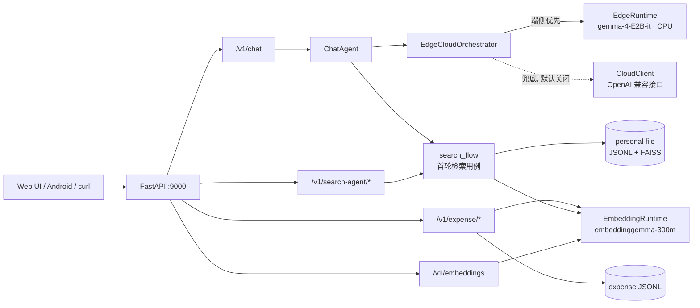
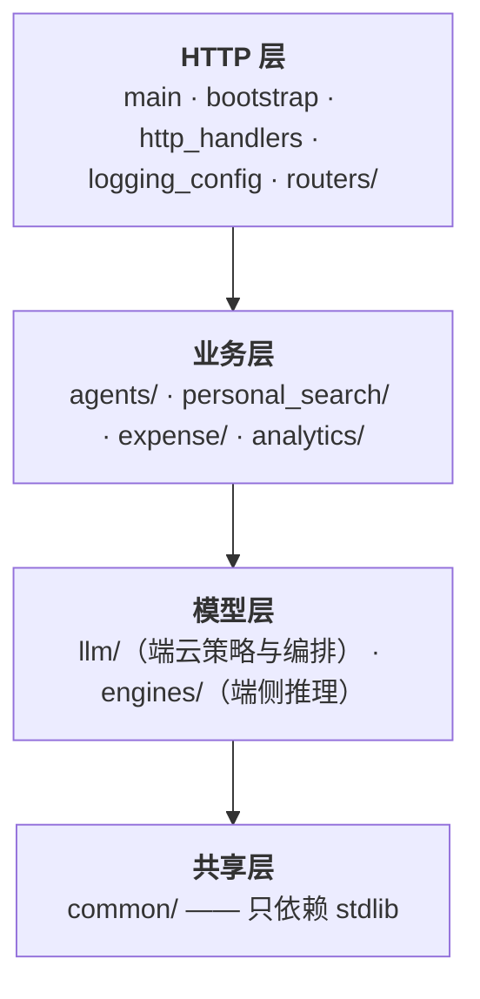

# 端上文件助手 · 端云结合 Agent

**端侧优先、云端可选**的轻量 Agent：端侧用 `google/gemma-4-E2B-it`（生成，约 9.6 GB）
+ `google/embeddinggemma-300m`（向量，约 1.2 GB）在本机推理，云端为可选兜底
（OpenAI 兼容接口，默认关闭）。数据全部本地存储（JSONL + FAISS），无外部数据库。

在此之上打通两个端侧场景：

| 场景 | 闭环 | 状态 |
|---|---|---|
| 🔍 个人文件搜索 | 模糊口述 → 追问消歧 → 命中动作（打开/分享/对比/备注/归档） | 后端完成，Android MVP 已接通 |
| 🧾 报销材料管理 | 收进来 → 找回来 → 拿出去 | 后端 V1 完成 |

典型体验：说一句「上周群里发的聚餐照片」，服务在本地索引里检索、必要时反问一轮
（"上周的还是群里那张？"），命中后可直接打开 / 分享 / 归档。

浏览器打开 `http://127.0.0.1:9000/web/` 即可用（FastAPI 同源静态托管，零 CORS、
零打包步骤）；接口清单见 [docs/API.md](docs/API.md)。

---

## 快速开始

### macOS / Linux

```bash
# 1. 安装依赖（transformers 钉 5.17.0）
python -m venv .venv && source .venv/bin/activate
pip install -r requirements.txt

# 2. 下载端侧权重到 models/（已 gitignore）
hf download google/gemma-4-E2B-it --local-dir models/google/gemma-4-E2B-it
# embeddinggemma-300m 若走 ModelScope: snapshot_download(..., cache_dir="models")
# 会落到 models/google/embeddinggemma-300m；两种途径详见 docs/QUICKSTART.md §1.1

# 3. 配置环境变量（逐项注释见 .env.example）
cp .env.example .env
#    关键三项：
#    - EDGE_LOCAL_DIR / EDGE_EMBEDDING_LOCAL_DIR 指向第 2 步的权重目录
#    - EDGE_DEVICE=cpu / EDGE_EMBEDDING_DEVICE=cpu（Apple Silicon 必须，见「已知约束」）
#    - CLOUD_ENABLED=false（默认，端侧 only）

# 4. 配置文件索引源目录（自动识别 Windows 原生 / WSL / macOS / Linux）
python scripts/sources.py             # 探测常见目录 → 交互多选 → 写入 .env

# 5. 启动并验证
make run                              # 或 bash scripts/run.sh
curl http://127.0.0.1:9000/health
```

`/health` 返回各项子服务的就绪状态（不只是「进程活着」）：

```json
{
  "ok": true,
  "degraded": false,
  "services": {
    "edge_llm": true, "embedding_runtime": true,
    "personal_file_service": true, "expense_service": true, "metrics": true
  },
  "cloud_enabled": false
}
```

`degraded=true` 表示有子服务未就绪但进程仍能服务（全链路静默降级是刻意设计，
见「已知约束」）。HTTP 状态码**始终是 200**：`scripts/deploy.sh` 与
`scripts/service.sh` 用 `curl -fsS | grep -q '"ok"'` 做门禁，`-f` 会把 503
当失败并死等到超时。要看明细就读 `degraded` 与 `services`。

### Windows 原生（非 WSL）

没有 make/bash，用跨平台启动器：

```bat
python -m venv .venv
.venv\Scripts\pip install -r requirements.txt
copy .env.example .env                & rem 按需修改
python scripts\sources.py             & rem 交互选择要索引的目录（--print 只列候选不写）
python scripts\run.py                 & rem 或 scripts\run.bat
```

### 测试与静态检查

```bash
make install    # 运行时 + 开发依赖（pytest、ruff）装进项目 venv
make check      # = make lint + make test；不需要模型权重
```

> **为什么用 `make` 而不是裸 `pip` / `pytest`**：PATH 上的裸命令可能指向 conda
> 等其它解释器。本机实测裸 `pytest` 会跑 miniconda 的 Python 3.14 + fastapi
> 0.139，而 `requirements.txt` 钉的是 fastapi 0.116，结果与真实运行环境不一致；
> `make install` 走裸 `pip` 还会把包装进 conda base。Makefile 里的 `$(PY)` 按
> `.venv` → `$VIRTUAL_ENV` → `python3` 顺序解析（兼容 `bin/python` 与
> `Scripts/python.exe`），与 `scripts/run.py` 同款逻辑。

`make help` 列出全部目标：`install` / `run`（macOS/Linux）/ `run-any`（跨平台）/
`sources` / `test` / `lint` / `check` / `deploy` / `start` / `stop` / `restart` /
`status` / `logs` / `uninstall`。

### 部署到 Linux 服务器

```bash
bash scripts/deploy.sh          # 一键：依赖 + 权重 + systemd 单元 + 健康检查
bash scripts/service.sh status  # start/stop/restart/status/logs/health
```

无 systemd 时 `service.sh` 自动降级为 PID 托管模式。详见
[docs/DEPLOYMENT.md](docs/DEPLOYMENT.md)。完整安装步骤、云端启用与常见报错排查见
**[docs/QUICKSTART.md](docs/QUICKSTART.md)**。

---

## 架构

### 请求流


```mermaid
flowchart LR
  C["Web UI / Android / curl"] --> API["FastAPI :9000"]
  API --> CHAT["/v1/chat"]
  API --> EMB["/v1/embeddings"]
  API --> EXP["/v1/expense/*"]
  API --> PSA["/v1/search-agent/*"]

  CHAT --> AG["ChatAgent"]
  AG --> ORCH["EdgeCloudOrchestrator"]
  ORCH -->|"端侧优先"| EDGE["EdgeRuntime<br/>gemma-4-E2B-it · CPU"]
  ORCH -.->|"兜底, 默认关闭"| CLOUD["CloudClient<br/>OpenAI 兼容接口"]

  PSA --> SF["search_flow<br/>首轮检索用例"]
  AG --> SF
  SF --> PSDB[("personal file<br/>JSONL + FAISS")]
  EXP --> EXPDB[("expense JSONL")]

  EMB --> EMBR["EmbeddingRuntime<br/>embeddinggemma-300m"]
  SF --> EMBR
  EXP --> EMBR
```

`ChatAgent` 与 `/v1/search-agent/search` 共用同一个 `search_flow` 用例，所以
Agent 层不经过 HTTP 也能被单测（`tests/test_architecture_layers.py` 守着这条）。

### 包内分层


```mermaid
flowchart TD
  L1["<b>HTTP 层</b><br/>main · bootstrap · http_handlers · logging_config · routers/"]
  L2["<b>业务层</b><br/>agents/ · personal_search/ · expense/ · analytics/"]
  L3["<b>模型层</b><br/>llm/（端云策略与编排） · engines/（端侧推理）"]
  L4["<b>共享层</b><br/>common/ —— 只依赖 stdlib"]
  L1 --> L2 --> L3 --> L4
```

依赖方向是**单向**的，且由 `tests/test_architecture_layers.py` 用 AST 静态校验：
当前 15 条跨包依赖边固化成白名单，新增任何一条都会让测试变红，逼出一次显式决定
（层边界破了不会有任何报错，只会在几个月后表现为「改 `common/` 要跑全量测试」
这类说不清来源的成本）。`routers/` 之间不互相调用，跨路由共用的 `app.state`
读取集中在 `routers/deps.py`。

### 聊天路由策略

细节见 [docs/ARCHITECTURE.md](docs/ARCHITECTURE.md)。

1. `force_cloud=true` / 输入超长（`ROUTE_MAX_INPUT_CHARS`，默认 1800）/ 命中关键词
   （"最新""实时"等）→ 云端（若启用）
2. 否则端侧优先；置信度 < `ROUTE_MIN_EDGE_CONFIDENCE`（默认 0.50）或输出过短时可升级云端
3. 云端失败**绝不抛 500**，依次回退：已有端侧结果 → 重跑端侧 → 明确降级提示
4. `CLOUD_ENABLED=false` 时全部路径退化为端侧 only，`reason` 字段全程透传路由决策

业务层机制（检索打分、消歧收敛、索引管道、字段抽取）见
**[docs/BUSINESS_LAYER.md](docs/BUSINESS_LAYER.md)**。

---

## 模块地图

完整目录树与「新代码该放哪」的约定见
**[docs/PROJECT_STRUCTURE.md](docs/PROJECT_STRUCTURE.md)**。

| 模块 | 职责 |
|---|---|
| `main.py` | FastAPI 入口：只装配路由、静态页面与 lifespan |
| `bootstrap.py` | lifespan 实现：服务装配、启动预热扫描、后台线程停止 |
| `http_handlers.py` | 请求追踪（trace_id）、统一异常响应、静态资源缓存规则 |
| `logging_config.py` | 结构化日志：固定字段 + 全部 `extra` 业务载荷渲染 |
| `config.py` | 全局环境变量配置（7 个 frozen dataclass） |
| `engines/` | 端侧模型引擎：`edge_runtime`（LLM）、`embedding_runtime`（向量，两条业务线共用）。两者各自持一把推理锁 |
| `llm/` | `routing`（端云策略）、`orchestrator`（端云调用与降级）、`cloud_client`（OpenAI 兼容客户端） |
| `agents/` | `chat`：决定何时查本地文件、何时请求 LLM，输出与 HTTP 无关的结果（可脱离 HTTP 单测） |
| `personal_search/` | 文件搜索业务线：`service`（检索/消歧/动作）、`ingest`（扫描/增量/清理）、`relevance`（打分规则）、`search_flow`（首轮用例）、`sessions`（消歧会话）、`actions`（文件动作）、`coverage`（索引覆盖）、`refresh`（节流刷新）、`presentation`（响应组装）、`vector_index`（FAISS）、`storage`、`schemas` |
| `expense/` | 报销业务线：`service`（抽取/检索/导出/纠正）、`ingest`（watch 目录）、`presentation`、`storage`、`schemas` |
| `analytics/` | 复盘指标：追加式事件流 + 指标计算（口径见 [docs/METRICS.md](docs/METRICS.md)） |
| `routers/` | 五组 HTTP 适配器 + `deps.py`（公共依赖）+ `schemas.py`（chat/embeddings/error 的 API 模型） |
| `web/` | 原生 ES module 前端：`app.js` 只做 Tab 导航，`js/{core,search,chat,expense,metrics}.js` 按功能拆分（WSL 访问见 [docs/WEB_UI.md](docs/WEB_UI.md)） |
| `scripts/` | `run.py`(+`run.bat`/`run.ps1`) 跨平台启动器、`run.sh` 供 systemd/nohup、`sources.py` 源目录助手、`deploy.sh`/`service.sh` 部署与运维 |
| `android/` | Android MVP 客户端（Kotlin + Compose），见 [android/README.md](android/README.md) |

### `common/`：只依赖 stdlib 的共享层

这一层存在的判据是「**同一段逻辑在两条业务线里出现了第二份**」。历史上这些重复
各自的修复只落在一边（详见 [docs/KNOWN_ISSUES.md](docs/KNOWN_ISSUES.md) R24–R31）：

| 模块 | 提供的能力 | 收敛了几份重复 |
|---|---|---|
| `text_utils` | 中英混合分词（jieba 可选，缺失自动降级纯规则口径） | — |
| `path_utils` | 平台判定、file URI 规范化与还原、Windows 路径映射 | — |
| `time_utils` | 全项目唯一的 naive UTC 秒精度时间口径 | 4 份 `now_iso` + 1 份 `parse` |
| `file_io` | 编码降级读取（utf-8-sig → gb18030）、二进制启发式、流式 `content_hash`、`atomic_write_text` / `atomic_write_lines` | 2 份 hash + **5 处**手搓 `tmp + os.replace` |
| `vectors` | `cosine_similarity` | 2 份逐行相同的实现 |
| `jsonl_store` | `JsonlSnapshotStore`：JSONL 快照存储基类（两个 store 子类只声明 `row_type`/`id_attr`/`index_attr`） | 10 个同名同形方法 |
| `fs_scan` | `iter_files`（`os.walk` + 整棵子树剪枝 + 排序）、`fingerprint` / `is_unchanged`（size + mtime_ns 变更检测）、`is_ghost`（按根可达的幽灵记录判定） | 2 份遍历 + 2 份清理 |
| `watch_loop` | `IngestResult` + `run_watch_loop`（调度、停止、失败可见、interval 夹取） | 2 份 `except Exception: pass` |
| `source_discovery` | 四平台索引源目录探测（纯函数 + 依赖注入，`scripts/sources.py` 的逻辑层） | — |

---

## API

14 个端点，完整请求/响应示例与**日志字典**见 **[docs/API.md](docs/API.md)**。

| 端点 | 说明 |
|---|---|
| `GET /health` | 健康检查（含 `degraded` 与逐项 `services` 明细） |
| `POST /v1/chat` | 端云路由聊天（`message`, `force_cloud`） |
| `POST /v1/embeddings` | 端侧文本向量化（`texts`, `normalize`） |
| `POST /v1/expense/collect` | 报销收进来：自动抽取金额/日期/商户，回显缺失材料 |
| `POST /v1/expense/search` | 报销找回来：关键词 + 金额/日期/类型过滤 |
| `POST /v1/expense/export` | 报销拿出去：生成可提交的材料清单 |
| `POST /v1/expense/correct` | 人工纠正抽取字段，计入复盘指标 |
| `POST /v1/expense/rebuild-index` | 手动触发 watch 目录扫描（权威全量 hash 校验） |
| `POST /v1/search-agent/search` | 文件搜索首查（返回状态机 + 候选 + 追问话术） |
| `POST /v1/search-agent/clarify` | 追问消歧（时间/来源/字面线索均可） |
| `POST /v1/search-agent/execute` | 命中动作：open / share / compare / annotate / archive |
| `POST /v1/search-agent/rebuild-index` | 手动重建文件索引（同上，走 `force_rehash`） |
| `GET /v1/search-agent/index-status` | 索引覆盖范围、扫描深度、`max_query_len` |
| `GET /v1/metrics` | 复盘指标 |

`GET /` 307 重定向到 `/web/`（静态前端）。

---

## 可观测性

**日志格式**：固定字段（时间、级别、logger、`event`、`trace_id`、`method`、
`path`、`status`、`dur_ms`）之后追加**全部 `extra` 业务载荷**，按 key 排序、
单行净化、长串与列表截断。渲染值为 `"-"` 的占位符会被跳过，避免默认上下文
污染每一行。

```
event=ingest.finished … cost_ms=3.12 errors=0 imported=0 index_ready=true
  rehashed=0 scanned=59 skipped=59 source_dir=… state_pruned=0
```

**关键事件**（全部可直接 grep，字典见 [docs/API.md](docs/API.md)）：

| event | 什么时候看它 |
|---|---|
| `ingest.finished` / `expense.ingest.finished` | 一轮扫描的结果。`rehashed` 是本轮真正读文件算 hash 的数量，**稳态下应接近 0**；若长期等于 `scanned`，说明 size+mtime 快路径没生效 |
| `ingest.watch.loop_started` / `loop_stopped` / `tick_failed` | 后台扫描线程是否活着、是否在持续失败。循环不会因异常中断，但每次失败都会记一条 |
| `search.query_truncated` | 调用方绕过了前端上限。只记长度不记原文 |
| `faiss.ids_mismatch` | 向量索引与 ids 边车错位（会静默返回错误的文件，故直接判未就绪并触发重建） |
| `faiss.rebuild` | 向量索引重建耗时与结果 |
| `http.request` | 每次请求的统一链路指标 |

**隐私口径**：日志只记长度、计数、ID 与异常**类型名**，不记查询原文、不记文件
内容、不记异常 message（消息里常带完整路径）。全仓一致。

---

## 配置

全部经环境变量驱动，`cp .env.example .env` 后按需修改。**带完整逐项注释的
[.env.example](.env.example) 是配置的权威参考**；`tests/test_config_env_parity.py`
用 AST 静态比对 `config.py` 的字面默认值与 `.env.example`，两边漂移会直接失败
（`.env` 被 gitignore，所以新克隆跑的就是默认值 —— 漂移意味着行为与文档相反
且没有任何报错）。

| 分组 | 关键变量 | 默认 / 说明 |
|---|---|---|
| 端侧 LLM | `EDGE_MODEL_ID` · `EDGE_LOCAL_DIR` · `EDGE_DEVICE` · `EDGE_DTYPE` · `EDGE_QUANTIZATION` | `google/gemma-4-E2B-it`；本地权重目录优先；Apple Silicon 须 `cpu`；`none`=不量化 |
| 端侧 embedding | `EDGE_EMBEDDING_MODEL_ID` · `EDGE_EMBEDDING_LOCAL_DIR` · `EDGE_EMBEDDING_DEVICE` · `EDGE_EMBEDDING_TORCH_DTYPE` | `google/embeddinggemma-300m`；`bfloat16` 为本机验证取值 |
| 云端（默认关） | `CLOUD_ENABLED` · `CLOUD_API_BASE` · `CLOUD_API_KEY` · `CLOUD_MODEL_ID` | `false`；`api_base` 与 `model` 默认空，启用时**必须显式配置**（缺失会在发请求前就报错） |
| 路由 | `ROUTE_USE_TINYLLM` · `ROUTE_MAX_INPUT_CHARS` · `ROUTE_MIN_EDGE_CONFIDENCE` | `true`=端侧优先（变量名系历史遗留，见「已知约束」）；1800；0.50 |
| 报销 | `EXPENSE_STORE_PATH` · `EXPENSE_REQUIRED_DOC_TYPES` · `EXPENSE_WATCH_DIR` · `EXPENSE_WATCH_INTERVAL_SECONDS` | `data/expense_store.jsonl`；`invoice,bank_transfer,receipt,approval`；watch 目录空=关闭自动收集；120s |
| 文件搜索 | `FILE_MEMORY_SOURCE_DIR` · `FILE_MEMORY_SCAN_EXCLUDE_DIRS` · `FILE_MEMORY_SCAN_INTERVAL_SECONDS` · `FILE_MEMORY_TEXT_ENCODINGS` · `FILE_MEMORY_SKIP_CLOUD_PLACEHOLDERS` · `FILE_MEMORY_ENABLE_FAISS` · `FILE_MEMORY_FAISS_*_WEIGHT` · `FILE_MEMORY_MAX_QUERY_LEN` | 源目录支持逗号分隔多根（统一用 `python scripts/sources.py` 交互配置），空=仅用已有索引；排除目录默认剪掉 node_modules / .Spotlight / `$RECYCLE.BIN` / 各类缓存；120s；编码降级链 utf-8-sig→gb18030；Windows 默认跳过 OneDrive「仅在线」占位符；文本/语义/线索权重 0.65/0.30/0.25；查询上限 120（由 `index-status` 下发给前端，单一事实源） |
| 日志 | `APP_LOG_LEVEL` | `INFO` |

---

## 产品目标与复盘指标（V1）

复盘只看「用户再次回来」。采集已落地（`analytics/` → 事件流 JSONL →
`GET /v1/metrics` → Web UI「📈 复盘」Tab），精确口径与已知偏差见
**[docs/METRICS.md](docs/METRICS.md)**：

- **报销**：同一 `claim_id` 14 天内再次 search/export 的占比；收集后 1 小时内
  补齐材料的成功率；自动抽取字段的纠正次数（越少越好）
- **文件搜索**：追问后最终 resolved 并执行动作的会话占比

比率的分母为 0 时返回 `null`（"样本不足"），**不以 `0.0` 冒充**。

---

## Android 客户端（MVP）

`android/`，Kotlin + Compose + Retrofit，`minSdk 29` / `targetSdk 34`：

- 已打通 `search → clarify → execute` 完整交互闭环与索引重建
- 端侧能力（不依赖模型）：MediaStore 文件变更监听 + 去抖增量扫描、本地索引持久化、
  周期扫描、运行时权限引导、日志落盘 `runtime_events.log`
- JNI 已链接 `third_party/tiny-llm`（Git 子模块），可在「端侧模型推理」页导入
  `.tqwen` 并按 token ID 在本机 CPU 生成；自然语言分词/解码尚未接入，文件搜索
  仍调用 Python 服务

运行方式与目录说明见 **[android/README.md](android/README.md)**。

---

## 测试与质量门禁

```bash
make check      # = ruff check + pytest；不需要模型权重
```

`ruff.toml` 里每条 `ignore` 都注明了理由，避免后人当成疏漏「顺手修掉」——
例如 `RUF001-003` 关掉是因为中文全角标点在本项目是**正确写法**（默认规则集会
产出约 1500 条噪音），`BLE001`/`S110`/`S112` 关掉是因为全链路静默降级是刻意
设计。文件顶部还写明了 ruff 的能力边界：它只做单文件分析、**不跨模块解析导入**，
所以抓不到「`from .x import` 一个已被移走的符号」这类错误。

覆盖范围：分词（jieba 与降级两种口径）、时间线索匹配、状态判定、澄清重排收敛、
回复过滤、报销字段抽取、JSONL 往返与容错、增量扫描生命周期、多根源目录与排除
剪枝、file URI 规范化与还原、编码降级、四平台源目录探测、跨平台启动器、云端
客户端配置校验。

另有一组**结构性回归**，专盯那些不会被业务用例覆盖、却能让整个服务起不来或
静默退化的问题：

| 测试 | 防的是什么 |
|---|---|
| `test_import_smoke.py` | 任何模块 import 失败。这类错误曾让 `main` 连锁失败、应用完全起不来，而因为 `/health` 之外的东西都没跑过，它在工作区里存活了整段时间 |
| `test_architecture_layers.py` | 跨包依赖方向被破坏（AST 静态扫，连未使用的 import 也算，`# noqa` 绕不过去）；`runtime/` 兼容垫片被恢复 |
| `test_config_env_parity.py` | `config.py` 默认值与 `.env.example` 漂移。曾出现默认量化方式与文档相反，新克隆会静默加载完全错误的模型 |
| `test_common_primitives.py` | 原子写、余弦、JSONL 快照基类退化。这三处承载两条业务线的全部持久化与全部相似度打分，而退化是静默的（坏行被跳过、`\uXXXX` 照样能 `json.loads`） |
| `test_fs_scan.py` | 目录扫描退化：排除目录变成「遍历后过滤」而非剪枝（结果相同、代价差几个数量级）、符号链接环让后台线程挂死、`mtime` 缺失被判成「没变」导致存量记录永远发现不了内容变更 |
| `test_watch_loop.py` | 后台摄取循环的失败重新变成静默。这是索引保持新鲜的唯一自动机制，坏了只会表现为「新文件搜不到」 |
| `test_web_contract.py` | 前端硬编码的查询长度上限与后端不一致（曾长期 260 vs 120，超出部分被静默截断） |
| `test_inference_concurrency.py` | 两个模型运行时的前向被并发调用。14 个端点里 13 个是同步 `def`，FastAPI 把它们丢进同一个 anyio 线程池（默认 40 个 token）；`/health` 是唯一 `async def`，为的正是推理锁排队时不被一起饿死 |
| `test_logging_config.py` | 日志 formatter 重新变成只渲染固定字段、把全部 `extra` 业务载荷丢掉（曾导致 `docs/API.md` 的日志字典形同虚设） |
| `test_docs_contract.py` | README 与代码/文档漂移：死链、`docs/` 里有文档没被索引、配置表写着已改名的环境变量、`common/` 模块表与实际模块不一致、端点数量写错。这些失效全是静默的，只会让下一个人照着做然后踩空 |

平台相关用例全部经 monkeypatch / 依赖注入模拟，任意 OS 上均可运行；模型运行时用
`object.__new__` 绕过 `__init__` 注入桩模型，故不需要下载权重。

---

## 已知约束

1. **Apple Silicon 必须 CPU 推理**：transformers 5.x 的 SDPA 在 MPS 上产出 NaN
   且非确定性（同一输入多次运行余弦值漂移），`EDGE_DEVICE` 与
   `EDGE_EMBEDDING_DEVICE` 均须设 `cpu`。
2. **全链路静默降级是刻意设计**：模型加载失败、FAISS 不可用、jieba 缺失、
   embedding 算不出来，都会降级而不是抛错。好处是服务总能起来，代价是**坏掉时
   不会自己喊**——所以有 `/health` 的 `degraded`/`services` 明细和结构化日志。
   改动降级路径前请先读 [docs/KNOWN_ISSUES.md](docs/KNOWN_ISSUES.md)。
3. **`ROUTE_USE_TINYLLM` 名不副实**：变量名沿用早期 TinyLlama 时代，现在 `true`
   的含义是"端侧优先"（端侧已是 E2B）。涉及面较广暂未重命名。
4. **量化链路已弃用但保留**：早期 TinyLlama + int4/gp32（GPTQ/BNB）路径需
   `optimum` + CUDA，本机不可用；可经 `EDGE_QUANTIZATION` 重新启用。默认 `none`。
5. **端侧 CPU 推理速度有限**：E2B 非量化 bfloat16 约 9.6 GB，首 token 延迟以秒计；
   embedding 单条短文本约百毫秒级。
6. **索引与部署机器/形态绑定**：`file_id` 由路径派生，同一文件在 WSL
   （`/mnt/c/...`）与 Windows 原生（`C:/...`）下 id 不同，store/FAISS 跨部署形态
   搬移会全量重导（备注/归档按 file_id 关联，也会失联）。换形态请重建索引。
7. **Windows 长路径（MAX_PATH 260）**：微信/OneDrive 深层嵌套文件会计入扫描
   `errors`（不中断）。建议开启系统 `LongPathsEnabled`；**不引入** `\\?\` 方案
   （会改变 `file_path`/`file_uri`/`file_id` 字面值，破坏索引稳定性）。
8. **指标事件流无界增长，但不能简单压缩**：`corrections_total` 等是全时段累计，
   任何「丢弃 N 天前事件」的策略都会静默改变已文档化指标的口径。三个可选方案按
   侵入性递增记在 KNOWN_ISSUES O13，**必须先改文档口径再改代码**。
9. 业务层遗留项（中文分词、会话持久化等）见
   [docs/BUSINESS_LAYER.md](docs/BUSINESS_LAYER.md) §四。

---

## 文档索引

| 文档 | 内容 |
|---|---|
| [docs/PROJECT_STRUCTURE.md](docs/PROJECT_STRUCTURE.md) | 仓库目录树与「新代码该放哪」的约定 |
| [docs/QUICKSTART.md](docs/QUICKSTART.md) | 安装、权重下载、启动、云端启用、FAQ |
| [docs/DEPLOYMENT.md](docs/DEPLOYMENT.md) | Linux 服务器部署：一键脚本、systemd、服务管理、排错 |
| [docs/WEB_UI.md](docs/WEB_UI.md) | Web 页面功能说明与 WSL 部署（localhost 转发 / 镜像网络 / systemd） |
| [docs/API.md](docs/API.md) | 全部接口的请求/响应示例 + **日志字典** |
| [docs/ARCHITECTURE.md](docs/ARCHITECTURE.md) | 端云路由架构、逐文件职责、设计要点 |
| [docs/BUSINESS_LAYER.md](docs/BUSINESS_LAYER.md) | 业务层两条线的机制细节与遗留清单 |
| [docs/METRICS.md](docs/METRICS.md) | 复盘指标口径：分子/分母/窗口/边界与已知偏差 |
| [docs/KNOWN_ISSUES.md](docs/KNOWN_ISSUES.md) | 问题台账：已修复 R1–R31（每条含原现象/修复方式/防回归/已证伪）+ 未修复 O 系列（编号有跳号，O3 不存在） |
| [docs/edge-model-budget.md](docs/edge-model-budget.md) | 端侧模型体积与质量预算测算 |
| [docs/edge-runtime-data-layout.md](docs/edge-runtime-data-layout.md) | 端侧运行时数据目录布局 |
| [docs/gemma4-reference-spec.md](docs/gemma4-reference-spec.md) | gemma4 文本前向逐算子参考规范 |
| [docs/gemma4-cpu-op-bitwise-inventory.md](docs/gemma4-cpu-op-bitwise-inventory.md) | gemma4 CPU 算子逐位算术清单（Vulkan 复现依据，反汇编核实） |
| [docs/gemma4-qat-gguf-inventory.md](docs/gemma4-qat-gguf-inventory.md) | 官方 QAT Q4_0 GGUF 的完整张量清单与转换对照（从 GGUF 头部实测解析） |
| [docs/gemma4-vulkan-plan.md](docs/gemma4-vulkan-plan.md) | gemma4 i4 上 Android Vulkan GPU 的立项计划、逐位门禁与止损点 |
| [docs/tiny-llm-gemma4-ple-design.md](docs/tiny-llm-gemma4-ple-design.md) | tiny-llm 支持 gemma4 + PLE 流式加载的设计 |
| [android/README.md](android/README.md) | Android MVP 客户端说明 |
