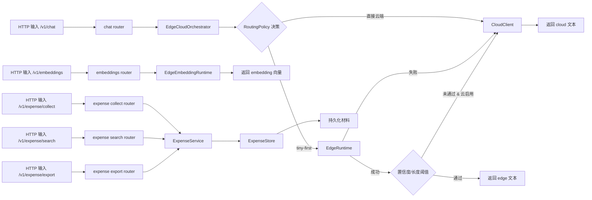

# Edge-Cloud Agent 架构说明

## 文件职责

- `src/edge_cloud_agent/config.py`
  - 读取环境变量，定义三类配置：`EdgeConfig`、`CloudConfig`、`RouteConfig`、`EmbeddingConfig`、`ExpenseConfig`。
- `src/edge_cloud_agent/runtime/routing.py`
  - 纯策略层：负责 `edge` 与 `cloud` 的决策（不依赖外部请求服务）。
- `src/edge_cloud_agent/runtime/agent.py`
  - 编排器：将策略、端侧推理、云侧回退组合成一次完整路由。
- `src/edge_cloud_agent/runtime/edge_runtime.py`
  - 本地模型生命周期：模型选择、tokenizer 与模型加载、量化回退链路、推理与置信度估计。
- `src/edge_cloud_agent/runtime/embedding_runtime.py`
  - 本地向量模型加载与 batch 推理（默认 `google/embeddinggemma-300m`）。
- `src/edge_cloud_agent/expense/service.py`
  - 报销材料的提取、检索、导出编排。
- `src/edge_cloud_agent/expense/storage.py`
  - 本地 JSONL 存储与查询（不依赖外部数据库）。
- `src/edge_cloud_agent/expense/schemas.py`
  - 报销流程三动作（收进来/找回来/拿出去）数据结构。
- `src/edge_cloud_agent/routers/expense.py`
  - `POST /v1/expense/collect|search|export` 路由入口。
- `src/edge_cloud_agent/runtime/cloud_client.py`
  - OpenAI 兼容接口调用，负责云端请求和响应提取。
- `src/edge_cloud_agent/routers/chat.py`
  - 定义 `POST /v1/chat` 的 Pydantic schema 与路由处理。
- `src/edge_cloud_agent/routers/embeddings.py`
  - 定义 `POST /v1/embeddings` 的 Pydantic schema 与路由处理。
- `src/edge_cloud_agent/main.py`
  - FastAPI 应用入口，完成依赖注入并挂载路由。
- `scripts/run.sh`
  - 一键启动脚本，包含常用环境变量加载。
- `Makefile`
  - 常用本地运维命令：运行、安装依赖。

## 设计要点

- 默认策略：端侧优先，端侧 LLM 为 `google/gemma-4-E2B-it`（非量化，bfloat16）。
  早期的 TinyLlama-1.1B + int4/gp32 量化链路已弃用（依赖 `optimum` 且需 CUDA），
  代码保留，可通过 `EDGE_QUANTIZATION` 重新启用。
- 云端是可选，受 `CLOUD_ENABLED` 控制；云端模型选型未定。
- `google/embeddinggemma-300m` 作为端侧 embedding 默认模型（768 维）。
- 设备：`EDGE_DEVICE` / `EDGE_EMBEDDING_DEVICE` 控制推理设备。Apple Silicon 上须为 `cpu`——
  transformers 5.x 的 SDPA 在 MPS 上产出 NaN 且非确定性，详见 KNOWN_ISSUES.md。
- 当云端关闭时，路由不会尝试云端；端侧不可用会返回明确错误提示。
- V1 目标聚焦“报销场景”，以 `collect/search/export` 先把“用户愿意反复回来”的闭环做起来。
