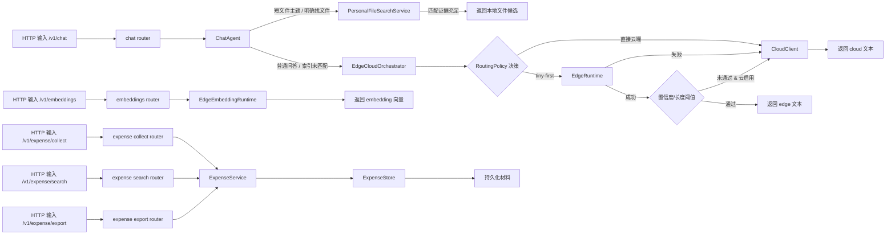

# Edge-Cloud Agent 架构说明

```mermaid
flowchart LR
  A[HTTP 输入 /v1/chat] --> B[chat router]
  B --> BA[ChatAgent]
  BA -->|短文件主题 / 明确找文件| PS[PersonalFileSearchService]
  PS -->|匹配证据充足| PR[返回本地文件候选]
  BA -->|普通问答 / 索引未匹配| C[EdgeCloudOrchestrator]
  C --> D{RoutingPolicy 决策}
  D -->|直接云端| E[CloudClient]
  D -->|tiny-first| F[EdgeRuntime]
  F -->|失败| E
  F -->|成功| G{置信度/长度阈值}
  G -->|通过| H[返回 edge 文本]
  G -->|未通过 & 云启用| E
  E --> I[返回 cloud 文本]

  A2[HTTP 输入 /v1/embeddings] --> B2[embeddings router]
  B2 --> ER[EdgeEmbeddingRuntime]
  ER --> EMB[返回 embedding 向量]

  A3[HTTP 输入 /v1/expense/collect] --> B3[expense collect router]
  B3 --> ES[ExpenseService]
  ES --> ST[ExpenseStore] 
  ST --> ED[持久化材料]

  A4[HTTP 输入 /v1/expense/search] --> B4[expense search router]
  B4 --> ES

  A5[HTTP 输入 /v1/expense/export] --> B5[expense export router]
  B5 --> ES
```

## 文件职责

- `src/edge_cloud_agent/config.py`
  - 读取环境变量，定义三类配置：`EdgeConfig`、`CloudConfig`、`RouteConfig`、`EmbeddingConfig`、`ExpenseConfig`。
- `src/edge_cloud_agent/agents/chat.py`
  - Agent 业务决策：用文件检索证据判断是否返回候选，否则交给 LLM；不依赖 HTTP。
- `src/edge_cloud_agent/llm/routing.py`
  - 纯策略层：负责 `edge` 与 `cloud` 的决策（不依赖外部请求服务）。
- `src/edge_cloud_agent/llm/orchestrator.py`
  - LLM 编排器：将策略、端侧推理、云侧回退组合成一次完整路由。
- `src/edge_cloud_agent/engines/edge_runtime.py`
  - 本地模型生命周期：模型选择、tokenizer 与模型加载、量化回退链路、推理与置信度估计。
- `src/edge_cloud_agent/engines/embedding_runtime.py`
  - 本地向量模型加载与 batch 推理（默认 `google/embeddinggemma-300m`）。
- `src/edge_cloud_agent/expense/service.py`
  - 报销材料的提取、检索、导出编排。
- `src/edge_cloud_agent/expense/storage.py`
  - 本地 JSONL 存储与查询（不依赖外部数据库）。
- `src/edge_cloud_agent/expense/schemas.py`
  - 报销流程三动作（收进来/找回来/拿出去）数据结构。
- `src/edge_cloud_agent/routers/expense.py`
  - `POST /v1/expense/collect|search|export` 路由入口。
- `src/edge_cloud_agent/personal_search/actions.py`
  - 与 HTTP 无关的文件动作执行（打开、分享、备注、归档、对比）；路由将业务异常映射成原有 HTTP 错误码。
- `src/edge_cloud_agent/personal_search/coverage.py`、`refresh.py`、`presentation.py`
  - 分别计算索引覆盖状态、管理每应用实例的后台刷新节流、统一组装搜索结果及建议动作。
- `src/edge_cloud_agent/personal_search/search_flow.py`
  - 首轮检索用例：触发节流刷新、执行检索、记录首轮埋点并组装响应；聊天 Agent 与 `/v1/search-agent/search` 共用。
- `src/edge_cloud_agent/expense/presentation.py`
  - 报销响应组装（抽取置信度、导出材料、导出时间戳）。
- `src/edge_cloud_agent/routers/deps.py`
  - 路由层公共依赖读取：服务就绪检查与 503、trace_id、复盘埋点入口。
- `src/edge_cloud_agent/llm/cloud_client.py`
  - OpenAI 兼容接口调用，负责云端请求和响应提取。
- `src/edge_cloud_agent/common/`
  - 跨层共享工具（只依赖 stdlib）：分词、路径/URI、文件读写与原子落盘、时间口径、
    向量度量、JSONL 快照存储基类、四平台源目录探测。
- `src/edge_cloud_agent/routers/chat.py`
  - `POST /v1/chat` 的 HTTP 适配器；请求/响应模型在 `routers/schemas.py`。
- `web/app.js`、`web/js/`
  - 原生 ES module 入口与按功能拆分的页面脚本（通用工具、搜索、聊天、报销、指标）。
- `src/edge_cloud_agent/routers/embeddings.py`
  - 定义 `POST /v1/embeddings` 的 Pydantic schema 与路由处理。
- `src/edge_cloud_agent/main.py`
  - FastAPI 应用入口，装配路由、静态页面与 lifespan。
- `src/edge_cloud_agent/http_handlers.py`、`logging_config.py`
  - 注册请求追踪与统一错误响应，配置结构化日志输出。
- `src/edge_cloud_agent/bootstrap.py`
  - 提供 lifespan：启动时装配服务、预热个人文件索引并拉起后台扫描线程，退出时停止监听。
- `scripts/run.sh`
  - 一键启动脚本，包含常用环境变量加载。
- `Makefile`
  - 常用本地运维命令：运行、安装依赖。

## 设计要点

- 默认策略：端侧优先，端侧 LLM 为 `google/gemma-4-E2B-it`（非量化，bfloat16）。
  早期的 TinyLlama-1.1B + int4/gp32 量化链路已弃用（依赖 `optimum` 且需 CUDA），
  代码保留，可通过 `EDGE_QUANTIZATION` 重新启用。
- 云端是可选，受 `CLOUD_ENABLED` 控制；云端模型选型未定。
- `google/embeddinggemma-300m` 作为端侧 embedding 默认模型（768 维）。
- 设备：`EDGE_DEVICE` / `EDGE_EMBEDDING_DEVICE` 控制推理设备。Apple Silicon 上须为 `cpu`——
  transformers 5.x 的 SDPA 在 MPS 上产出 NaN 且非确定性，详见 KNOWN_ISSUES.md。
- 当云端关闭时，路由不会尝试云端；端侧不可用会返回明确错误提示。
- V1 目标聚焦“报销场景”，以 `collect/search/export` 先把“用户愿意反复回来”的闭环做起来。
